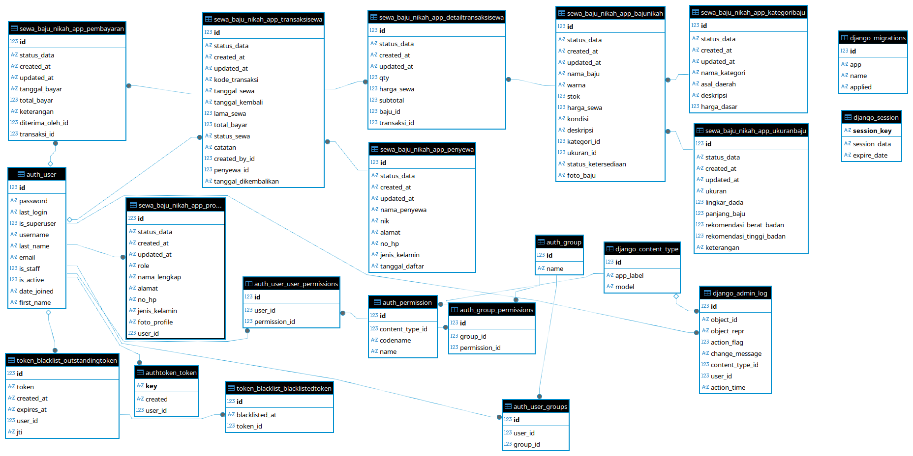

# SISTEM INFORMASI SEWA BAJU NIKAH TRADISIONAL

fokusnya:
* katalog baju
* penyewaan
* pembayaran cash
* pengembalian
* struk

---
---
# API Documentation
Untuk melihat detail endpoint, request body, dan response dari API ini, silakan kunjungi dokumentasi Postman melalui tautan di bawah ini:

[Dokumentasi API via Postman](https://documenter.getpostman.com/view/32072008/2sBXqRkxSK#3b84aa72-1c2b-48f1-9b29-ec18c9c85bc9)

---

# ERD


---
ERD pada Sistem Informasi Sewa Baju Nikah Tradisional menggambarkan hubungan antar data yang digunakan dalam proses penyewaan baju. Tabel utama pada sistem adalah tabel `bajunikah` yang menyimpan informasi baju seperti nama baju, harga sewa, stok, kondisi, dan status ketersediaan. Setiap baju terhubung dengan tabel `kategoribaju` untuk menentukan jenis atau asal daerah baju adat, serta terhubung dengan tabel `ukuranbaju` untuk informasi ukuran baju.

Proses penyewaan dikelola melalui tabel `transaksisewa` yang menyimpan data transaksi seperti tanggal sewa, tanggal kembali, total pembayaran, dan status sewa. Setiap transaksi terhubung dengan tabel `penyewa` karena satu penyewa dapat melakukan beberapa transaksi penyewaan. Detail baju yang disewa disimpan pada tabel `detailtransaksisewa` sebagai penghubung antara transaksi dan data baju, sehingga satu transaksi dapat memiliki lebih dari satu baju.

Pembayaran dicatat pada tabel `pembayaran` yang berhubungan dengan transaksi sewa dan user kasir yang menerima pembayaran. Selain itu, sistem juga memiliki tabel `profile` dan `auth_user` untuk mengatur data pengguna, role admin, dan kasir yang mengelola sistem. Dengan relasi antar tabel tersebut, sistem dapat mengelola data penyewaan, pembayaran, stok baju, dan pengembalian secara terintegrasi dan terstruktur.

---

# Bussiness Logic

Business logic pada Sistem Informasi Sewa Baju Nikah Tradisional berfokus pada pengelolaan katalog, transaksi penyewaan, pembayaran cash, pengembalian, dan pencetakan struk. Sistem ini memiliki tiga peran utama yaitu user, kasir, dan admin. User hanya dapat melihat katalog baju adat melalui aplikasi hybrid berbasis Flutter, seperti melihat foto baju, kategori, ukuran, harga, detail produk, serta status ketersediaan baju. User tidak dapat melakukan checkout maupun pembayaran online karena seluruh transaksi dilakukan secara langsung dengan metode pembayaran cash.

Kasir bertugas mengelola proses transaksi penyewaan. Ketika pelanggan datang ke toko atau menghubungi admin melalui WhatsApp, kasir akan menginput data penyewa seperti nama, nomor HP, dan alamat. Setelah itu kasir memilih baju yang ingin disewa beserta tanggal sewa dan tanggal pengembalian. Sistem kemudian melakukan pengecekan stok secara otomatis. Jika stok masih tersedia (stok > 0), maka transaksi dapat diproses. Setelah transaksi berhasil, stok baju akan berkurang. Jika stok mencapai 0, maka status ketersediaan otomatis berubah menjadi “Tidak Tersedia” sehingga baju tidak dapat disewa oleh pelanggan lain.

Setelah proses penyewaan selesai, kasir menerima pembayaran secara cash dan sistem akan menyimpan data pembayaran. Sistem juga menghasilkan struk transaksi yang berisi kode transaksi, nama penyewa, nama baju, tanggal sewa, dan total pembayaran. Pada saat baju dikembalikan, kasir melakukan proses pengembalian melalui sistem. Setelah pengembalian berhasil, stok baju otomatis bertambah kembali dan status ketersediaan berubah menjadi “Tersedia”.

Selain itu, admin memiliki hak akses untuk mengelola data kategori, ukuran, data baju, user, dan laporan transaksi. Sistem juga menyediakan public API untuk kebutuhan katalog aplikasi Flutter dan private API yang hanya dapat diakses oleh kasir atau admin setelah login.


---

# ROLE DALAM SISTEM

## 1. USER

HANYA:

* melihat katalog baju
* lihat foto
* lihat ukuran
* lihat harga
* lihat status tersedia
* lihat detail baju

TAPI:
- tidak bisa transaksi langsung
- tidak bayar online
- tidak checkout

Karena pembayaran cash.

---

# 2. KASIR

Yang melakukan:

* input penyewa
* membuat transaksi
* pembayaran cash
* cetak struk
* pengembalian baju

---

# 3. ADMIN

Mengelola:

* kategori
* ukuran
* baju
* user
* laporan

---

# FLOW USER (END USER)

---

## STEP 1 — USER BUKA APP

User membuka Flutter app.
Melihat:
* daftar baju adat
* kategori
* ukuran
* harga
* foto

---

# STEP 2 — USER TERTARIK

Misal:
user suka:

```text id="jlwm167"
Baju Adat Jawa Premium
```
---
# STEP 3 — USER DATANG KE TOKO / CHAT ADMIN

Karena pembayaran cash.
Jadi:
user:
* datang langsung
  ATAU
* chat WhatsApp admin

---

# STEP 4 — KASIR INPUT PENYEWA

Kasir login.
Lalu input:
* nama penyewa
* no hp
* alamat

---
# STEP 5 — KASIR BUAT TRANSAKSI

Kasir pilih:
* baju
* tanggal sewa
* tanggal kembali
---
# STEP 6 — SISTEM CEK STOK

Kalau:

```text id="-vesm6"
stok > 0
```

boleh transaksi.

---

# STEP 7 — STOK BERKURANG

Misal:
stok awal:

```text id="jlwm168"
2
```

setelah disewa:

```text id="jlwm169"
1
```

Kalau:

```text id="jlwm170"
0
```

maka:

```text id="jlwm171"
status_ketersediaan = TIDAK_TERSEDIA
```

---

# STEP 8 — PEMBAYARAN CASH

Kasir menerima uang cash.

Lalu:
buat data pembayaran.

---

# STEP 9 — CETAK STRUK

Output:

* kode transaksi
* nama penyewa
* nama baju
* tanggal sewa
* total bayar

---

# STEP 10 — PENGEMBALIAN

Saat baju kembali:

Kasir klik:

# KEMBALIKAN BAJU

---

# STEP 11 — STOK BERTAMBAH

Misal:

```text id="jlwm172"
stok = 0
```

jadi:

```text id="jlwm173"
stok = 1
```

lalu:

```text id="jlwm174"
status_ketersediaan = TERSEDIA
```

---

# KESIMPULAN FLOW

# USER

hanya:
- lihat katalog
- lihat ukuran
- lihat harga
- lihat status tersedia

---

# KASIR

yang melakukan:
- transaksi
- pembayaran cash
- pengembalian
- cetak struk

---

# PUBLIC API

tanpa login:

```text id="jlwm175"
GET /baju-nikah/
GET /kategori/
GET /ukuran/
GET /detail-baju/
```

untuk Flutter katalog.

---

# PRIVATE API

login kasir/admin:

```text id="jlwm176"
POST /penyewa/
POST /transaksi/
POST /pembayaran/
POST /pengembalian/
```
